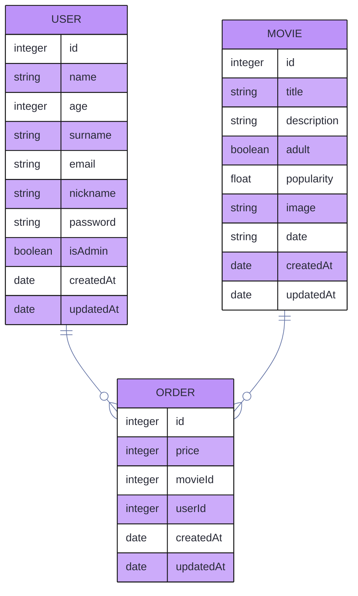

# movieClubBackend

## Installing

* First clone the repository:

    ```bash
    git clone https://github.com/luigiMinardi/movieClubBackend
    ```
    
    enter in the cloned repo `cd movieClubBackend` or open in your IDE, for example `code movieClubBackend` if you're using VSC.

* Install all the dependencies:

    NPM
    ```bash
    npm i
    ```
    Yarn
    ```bash
    yarn
    ```

* At `config/config.json` change:

    ```json
    "development": {
        ...,
        "password": "1234",
        "database": "movieClub",
        ...
    }
    ```

    To
    
    ```json
    "development": {
        ...,
        "password": "your_root_password",
        "database": "yourDatabaseName",
        ...
    }
    ```

* Create the data base:

    <u>**You need to have mysql installed and running on your computer for this to work**</u>. At the first time you may need to create the db directly on mysql (or your UI to use it (like Mysql Workbench)) since sometimes the `sequelize db:create` bugs, but after creating it will work fine so whenever you drop your db you can reacreate by the command instead of manually.

    NPM
    ```bash
    npx sequelize db:create
    ```
    Yarn
    ```bash
    yarn sequelize db:create
    ```

* Make the migrations:

    NPM
    ```bash
    npx sequelize db:migrate
    ```
    Yarn
    ```bash
    yarn sequelize db:migrate
    ```

* Run the server:

    NPM
    ```bash
    npm run dev
    ```
    Yarn
    ```bash
    yarn nodemon
    ```

Now you are ready to use it.

# Using the API

## Data Base draw


### Expected Behaviour

`createdAt`, `updatedAt`, `id`, are obligatory and auto-generated.

the `id` is the **Primary Key** of the tables.

USER `name`, `email`, are obligatory.

USER `email`, `nickname`, are unique.

MOVIE `title`, `description`, `adult`, are obligatory.

ORDER `movieId`, `userId`, `date`, are obligatory.

`movieId` and `userId` are the MOVIE and the USER **Foreign Key** respectively.

You may see references for the **Primary Key** as `pk` and for the **foreign key** as `fk`.

## Endpoints

To see the endpoints and how they works, check our [documentation](https://github.com/luigiMinardi/movieClubBackend/wiki).

# WIP

[] - Improve admin rights
[] - Creation of payment
[] - Refactor of view-controllers to be more restfull
[] - turn some endpoints in more generic versions of them to be more scalable
[] - Automated tests
[] - Adding error responses to the documentation