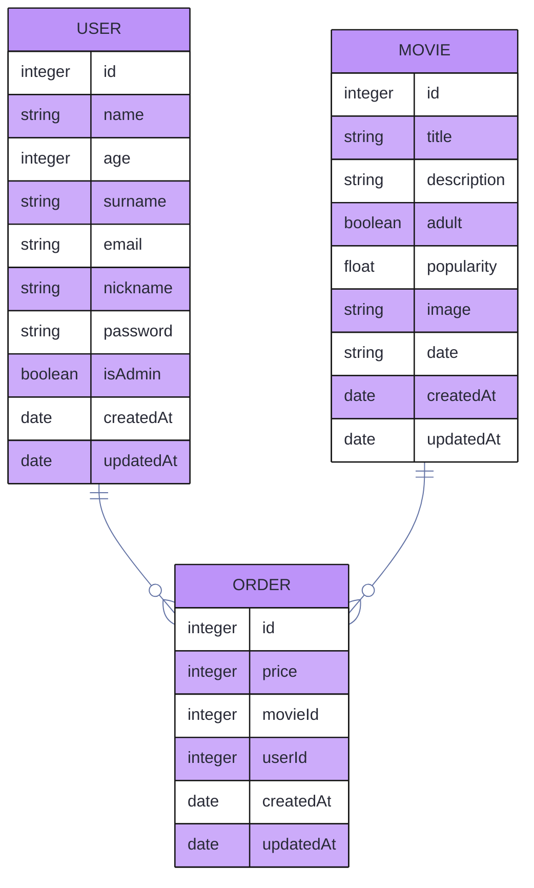

# movieClubBackend

<div align="center">


</div>

This is a REST API of a movie club, using mysql as data base. Having tables for `users`, `movies` and `orders`.

<div align="center">

[](https://github.com/luigiMinardi/movieClubBackend/wiki)

</div>

## Installing

-   First clone the repository:

    ```bash
    git clone https://github.com/luigiMinardi/movieClubBackend
    ```

    enter in the cloned repo `cd movieClubBackend` or open in your IDE, for example `code movieClubBackend` if you're using VSC.

-   Install all the dependencies:

    NPM

    ```bash
    npm i
    ```

    Yarn

    ```bash
    yarn
    ```

-   At `config/config.js` change:

    ```js
    "development": {
        ...,
        "password": process.env.DB_PASSWORD || null,
        "database": process.env.DB_NAME || 'database_development',
        ...
    }
    ```

    To

    ```js
    "development": {
        ...,
        "password": process.env.DB_PASSWORD || "your_root_password",
        "database": process.env.DB_NAME || "yourDatabaseName",
        ...
    }
    ```

-   Create the data base:

    <u>**You need to have mysql installed and running on your computer for this to work**</u>. At the first time you may need to create the db directly on mysql (or your UI to use it (like Mysql Workbench)) since sometimes the `sequelize db:create` bugs, but after creating it will work fine so whenever you drop your db you can reacreate by the command instead of manually.

    NPM

    ```bash
    npx sequelize db:create
    ```

    Yarn

    ```bash
    yarn sequelize db:create
    ```

-   Make the migrations:

    NPM

    ```bash
    npx sequelize db:migrate
    ```

    Yarn

    ```bash
    yarn sequelize db:migrate
    ```

-   Run the server:

    NPM

    ```bash
    npm run dev
    ```

    Yarn

    ```bash
    yarn nodemon
    ```

### Configuring .env

In your root repository create a `.env` file and add this:

```m
# index.js
PORT=3000 # server port

# config/auth
AUTH_SECRET="ShhhDontTellHim" # Key the encription will use to run
AUTH_EXPIRES="24h" # Token expiration
AUTH_ROUNDS=10 # Times the encription will be done

# DB.js
DB_HOST="127.0.0.1" # DB server
DB_PORT="3306" # Port of DB
DB_DIALECT="mysql" # Type of DB
# DB.js & models/index
DB_NAME="yourDatabaseName" # Name of DB
DB_USER="root" # Name of DB superuser
DB_PASSWORD="YourRootPassword" # Password of superuser

# models/index
NODE_ENV="development" # Type of enviroment at config/config.js

############ You can ignore from here on out. ############
############ Its just a example of how it will be on your deployment
############ you probably wont need those variables below.
## Deploy DB
## Remove the comments of those lines bellow and add a comment to
## the lines above with same variable names to change from
## development db to production one.
# DB_HOST="yourDeploy.cleardb.net" # DB server url generated by cleardb
# DB_PORT="3306"
# DB_DIALECT="mysql"
# DB_NAME="heroku_yourName" # DB name generated by heroku
# DB_USER="user" # DB superuser generated by heroku
# DB_PASSWORD="password" # superuser password generated by heroku
# NODE_ENV="production"
```

Now you are ready to use it.

# Using the API

## Data Base draw



### Expected Behaviour

`createdAt`, `updatedAt`, `id`, are obligatory and auto-generated.

the `id` is the **Primary Key** of the tables.

USER `name`, `email`, are obligatory.

USER `email`, `nickname`, are unique.

MOVIE `title`, `description`, `adult`, are obligatory.

ORDER `movieId`, `userId`, `date`, are obligatory.

`movieId` and `userId` are the MOVIE and the USER **Foreign Key** respectively.

You may see references for the **Primary Key** as `pk` and for the **foreign key** as `fk`.

## Endpoints

To see the endpoints and how they works, check our [documentation](https://github.com/luigiMinardi/movieClubBackend/wiki).

<div align="center">

[](https://github.com/luigiMinardi/movieClubBackend/wiki)

</div>

# WIP

-   [ ] -   Improve admin rights

-   [ ] -   Creation of payment

-   [ ] -   Refactor of view-controllers to be more restful

-   [ ] -   turn some endpoints in more generic versions of them to be more scalable

-   [ ] -   Field validation
        -   [ ] -   Email, Name, Nickname should NOT allow blank values ("")
        -   [ ] -   Email should NOT accept non email values (asdf = error, asdf@asdf = error, asdf@asdf.asdf = valid)
        -   [ ] -   Password minimal length and complexity.
        -   [ ] -   Return all input errors at once.

-   [ ] -   Automated tests

-   [ ] -   Adding error responses to the documentation
